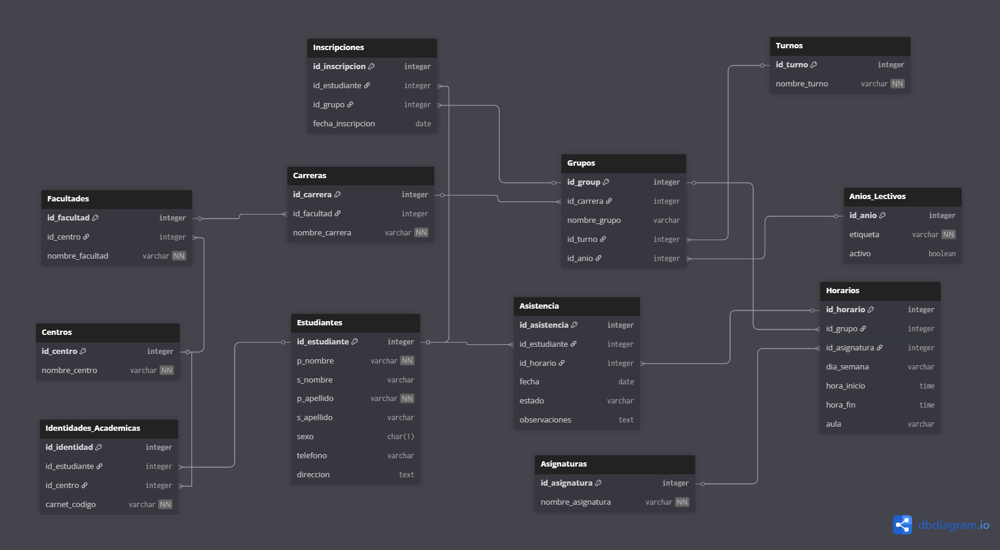

# 🏛️ SPAE - Sistema Profesional de Asistencia Estudiantil

<p align="center">
  
</p>

**SPAE** es una solución robusta desarrollada para **Shekinah Services**, diseñada específicamente para docentes que gestionan múltiples grupos en diversas instituciones educativas. El sistema centraliza el control de asistencia, horarios e identidades académicas en una interfaz moderna y eficiente.

---

## 🚀 Funcionalidades Clave

* **Gestión Multicentro:** Registra diferentes universidades o sedes (UNAN, INATEC, etc.) y asocia carnés específicos para cada estudiante en cada centro.
* **Estructura Jerárquica:** Organización completa por Facultades/Áreas de conocimiento y Carreras.
* **Control de Asistencia:** Registro rápido de estados (Presente, Ausente, Tardía, Excusa) con historial detallado.
* **Interfaz "Bootstrap-Style":** Navegación fluida y moderna basada en la paleta de colores institucional.
* **Arquitectura de Datos Normalizada:** Base de datos relacional para evitar duplicidad de información.

---

## 🛠️ Tecnologías

Este proyecto utiliza un stack tecnológico enfocado en la portabilidad y el rendimiento local:

* **Lenguaje:** [Python 3.10+](https://www.python.org/)
* **Interfaz Gráfica:** Tkinter con estilos personalizados (Custom Modern UI).
* **Base de Datos:** [SQLite 3](https://www.sqlite.org/) con soporte para integridad referencial (Foreign Keys).
* **Gestión de Imágenes:** [Pillow (PIL)](https://python-pillow.org/) para el manejo de assets visuales.

---

## 📊 Diseño de la Base de Datos

El sistema se basa en un modelo relacional optimizado para la escalabilidad. A continuación, se presenta el diagrama de entidad-relación:

<p align="center">
  
</p>

---

## 📁 Estructura del Proyecto

```text
SistemaAsistencia/
├── main.py              # Punto de entrada de la aplicación
├── database.py          # Motor de datos y lógica SQL
├── assets/              # Recursos visuales (Logos, Diagramas)
├── views/               # Módulos de interfaz (Vistas independientes)
│   ├── home_view.py     # Pantalla de bienvenida
│   ├── centros_view.py  # CRUD de Instituciones
│   └── ...              # Próximos módulos (Facultades, Estudiantes)
└── README.md            # Documentación del proyecto